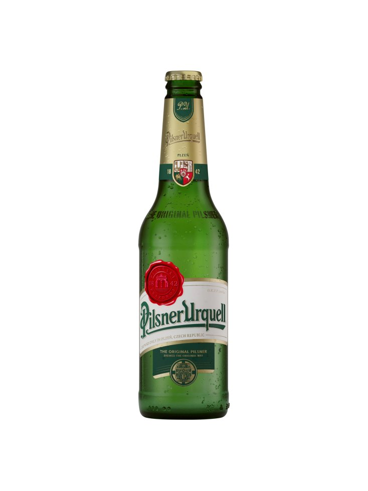

# Topics
Big Data concept, basic principles of distributed data processing, types and properties of
NoSQL databases. BE4M36DS2 (Course web pages)

# Questions
Big Data (V characteristics, current trends), NoSQL databases (motivation, features). Scaling (vertical, horizontal, network fallacies, cluster). Distribution models (sharding, replication, master-slave and peer-to-peer architectures). CAP theorem (properties, ACID, BASE). Consistency (strong, eventual, read, write, quora). Performance tuning (Amdahl’s law, Little’s law, message cost model). Polyglot persistence.

MapReduce (architecture, functions, data flow, execution, use cases). Hadoop (MapReduce, HDFS).

XPath (path expressions, axes, node tests, predicates). XQuery (constructors, FLWOR, conditional, quantified and comparison expressions). SPARQL (subgraph matching, graph patterns, datasets, filters, solution modifiers, query forms).

RiakKV (CRUD operations, links, link walking, convergent replicated data types, Search 2.0, vector clocks, Riak Ring, replica placement strategy). Redis (data types, operations, TTL). Cassandra (keyspaces, column families, CRUD operations). MongoDB (CRUD operations,
update and query operators, projection, modifiers).

Graph data structures (adjacency matrix, adjacency list, incidence matrix). Data locality (BFS layout, bandwidth minimization problem, Cuthill-McKee algorithm). Graph partitioning (1D partitioning, 2D partitioning). Neo4j (traversal framework, traversal description, traverser). Cypher (graph matching, read, write and general clauses).

